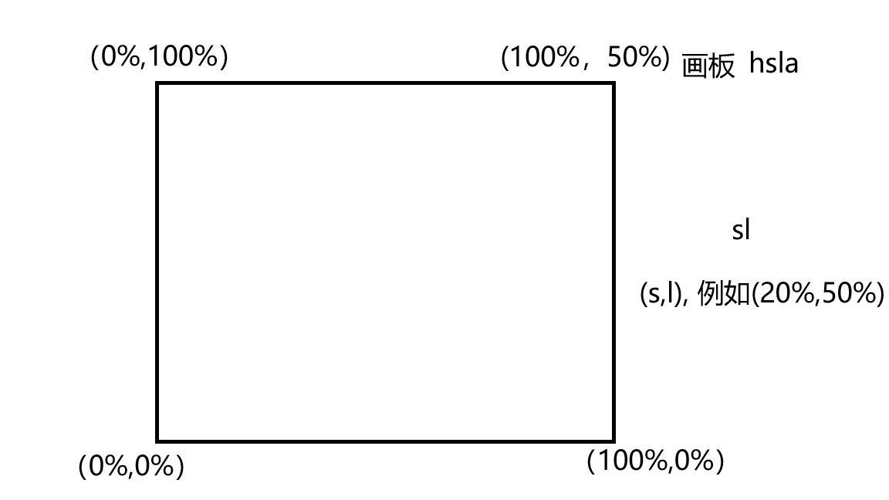
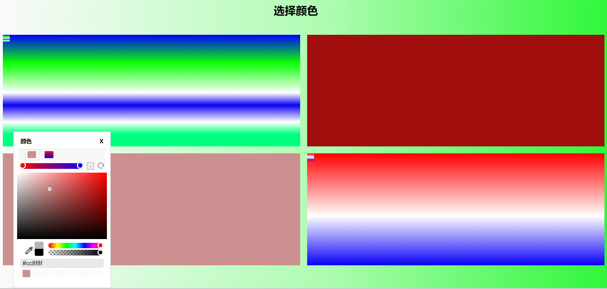
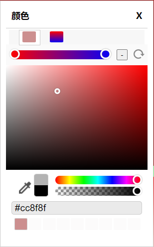

# 取色器
自定义取色器的布局，实现取色器


## 实现过程&步骤
### 1.自定义布局
使用html和css实现


### 2.实现取色器
大致思路：基于hsla实现以下功能

hsla(hue, saturation, lightness, alpha)\
色调、饱和度、亮度、透明度\
hsla(0, 100%, 50%, 0.5)

- 颜色板的取值
- 透明度的取值
- 色阶柱的取值

具体实现思路：
- 监听鼠标事件，计算出颜色板、透明度条、色阶柱的百分比值，获取到hsla值
- 将所获得的hsla值，转换成HEX值，并赋值给input标签的value属性


性能问题：\
可能会出现的问题有，卡顿、不连贯、鼠标监听事件不准确等

解决方案：\
暂定！！！

### 循环队列
使用队列来存储历史颜色

### 滑块的实现
```html
    <!-- 色阶滑块 -->
    <div class="xl-color-picker-bottom-right-saturation-slide"></div>
```

```css
.xl-color-picker-bottom-right-saturation-slide {
    width: 0.7rem;
    height: 0.7rem;
    border-radius: 50%;
    position: absolute;
    left: 50px;
    top: 7px;
    transform: translate(-5px, -5px);
    box-shadow: 0 0 0 3px #fff,
        inset 0 0 2px 2px rgb(0 0 0 / 0%),
        /*等价于rgba(0,0,0,0.4)*/
        0 0 2px 3px rgb(0 0 0 / 50%);
    /*等价于rgba(0,0,0,0.5)*/
    cursor: pointer;
}
```

```javascript
/**
 * 鼠标移动事件
 * @param {*} e 鼠标事件
 * @param {*} ele 移动元素条
 * @param {*} slide 滑块元素
 * @param {*} availableLabel 是否可用
 */
function mousemove(e, ele, slide, availableLabel) {
    if (!availableLabel) return;
    let width = ele.offsetWidth;  // 当前元素的宽度
    let height = ele.offsetHeight; // 当前元素的高度
    // 判断鼠标移动位置是否已经超出了box的范围，从而设置滑块的进度
    if (e.clientX <= ele.offsetLeft) {  // 最左
        updatedSlidePosition(slide, slide.offsetWidth / 2);
    } else if (e.clientX >= ele.offsetLeft + width) {  // 最右
        updatedSlidePosition(slide, width - slide.offsetWidth / 2);
    } else {  // 中间
        updatedSlidePosition(slide, e.clientX - ele.offsetLeft);
    }
}

/**
 * 鼠标按下事件
 * @param {*} ele 移动元素条
 * @param {*} slide 滑块元素
 * @param {*} availableLabel 是否可用
 */
function mousedown(ele, slide, availableLabel) {
    ele.addEventListener('mousedown', function (e) {
        availableLabel = true;
        // 透明度条的长度px
        let alphaBarWidth = ele.offsetWidth;
        // 当前点击位置的相对于条的宽度
        let leftWidth = e.clientX - ele.offsetLeft;

        // 滑块位置更新
        updatedSlidePosition(slide, leftWidth)

        // 绑定mousemove和mouseup事件到document上
        document.addEventListener('mousemove', function (e) {
            mousemove(e, ele, slide, availableLabel);
        }, false);
        document.addEventListener('mouseup', function (e) {
            availableLabel = false;
            // 解绑mousemove事件
            document.removeEventListener('mousemove', mousemove, false);
        }, false);
    });
}

// 透明度条的鼠标事件标签
let colorPickerBottomAlphaLabel = false;

// 透明度条的鼠标按下事件
mousedown(colorPickerBottomAlpha, colorPickerBottomAlphaSlide, colorPickerBottomAlphaLabel);
```

### html 页面不能选中状态
```css
user-select: none;
```

### 颜色格式的转换
使用工具类

### 色板的实现



### 吸管拾色器
原理：

1. 用户交互：

用户通过点击或激活吸管工具开始取色过程。
用户将吸管工具移动到想要获取颜色的位置。

2. 屏幕坐标获取：

吸管工具需要知道用户点击或选择的屏幕位置的坐标。

3. 颜色数据获取：

根据用户选择的屏幕坐标，吸管工具需要获取该位置的颜色数据。这通常涉及到以下几个技术：

a. Canvas API：

如果吸管工具在一个Canvas元素上操作，可以使用CanvasRenderingContext2D.getImageData()方法来获取像素数据。
这个方法返回一个ImageData对象，其中包含了一个像素数组，每个像素由四个部分组成：红、绿、蓝和透明度（RGBA）。

b. EyeDropper API：

这是一个浏览器提供的API，允许网页直接访问用户屏幕的颜色数据。
使用EyeDropper.open()方法，用户可以选择屏幕上的任何颜色，然后API会返回一个包含颜色信息的对象。

4. 颜色表示：

获得的颜色数据通常以RGB或RGBA格式表示，但也可以转换为其他颜色空间，如HEX或HSL。
例如，一个颜色可能以rgba(255, 255, 255, 1)的形式表示，这代表不透明的白色。

5. 用户反馈：

一旦获取了颜色数据，吸管工具通常会以某种方式向用户显示所选颜色，例如在颜色预览框中显示颜色，或者更新颜色值输入字段。

6. 颜色应用：

用户选择颜色后，可以将其应用于其他元素或操作，如填充一个图形、设置文本颜色等。

7. 性能和优化：

在实现吸管工具时，需要考虑性能问题，尤其是在处理大型图像或复杂页面时。
为了提高性能，可能需要对Canvas操作进行优化，或者限制颜色取样的频率。

实现方法：
1. 不使用工具
```javascript
    // 获取当前屏幕

    // 使用canvas获取屏幕鼠标下的每个像素

    // 返回颜色值
```

2. 使用EyeDropper API
```javascript
colorPickerBottomAbsorb.addEventListener("click", () => {
    console.log("点击了吸管");

    if (!window.EyeDropper) {
        resultElement.textContent = "你的浏览器不支持 EyeDropper API";
        return;
    }

    const eyeDropper = new EyeDropper();

    eyeDropper
        .open()
        .then((result) => {
            console.log("取色", result.sRGBHex);

        })
        .catch((e) => {
            console.log("取色失败", e);
        });
});

```

### 线性渐变
实现思路：\
使用数组存储颜色值，通过循环遍历数组，计算出颜色值，并设置到颜色板中

```javascript
// 数组格式

[
    {
        // 当前滑块
        'slider': newGradientSlider,
        // 滑块的默认颜色
        'color': color,
        // 距离渐变条的左侧距离
        'positionX': position,
        // 百分比
        'percentages': 0,
    },
    {
         // 当前滑块
        'slider': newGradientSlider,
        // 滑块的默认颜色
        'color': color,
        // 距离渐变条的左侧距离
        'positionX': position,
        // 百分比
        'percentages': 0,
    }
]

```


```css
/* 渐变轴为 45 度，从蓝色渐变到红色 */
linear-gradient(45deg, blue, red);

/* 从右下到左上、从蓝色渐变到红色 */
linear-gradient(to left top, blue, red);

/* 色标：从下到上，从蓝色开始渐变，到高度 40% 位置是绿色渐变开始，最后以红色结束 */
linear-gradient(0deg, blue, green 40%, red);

/* 颜色提示：从左到右的渐变，由红色开始，沿着渐变长度到 10% 的位置，然后在剩余的 90% 长度中变成蓝色 */
linear-gradient(.25turn, red, 10%, blue);

/* 多位置色标：45% 倾斜的渐变，左下半部分为红色，右下半部分为蓝色，中间有一条硬线，在这里渐变由红色转变为蓝色 */
linear-gradient(45deg, red 0 50%, blue 50% 100%);

```
渐变的百分比：0% - 100%

计算滑块到渐变条最左端的百分比


### 高度问题
色板操作的时候的高有问题， 初始化的时候渐变条的滑块位置问题

解决办法：
```javascript
// 获取元素相对于视口的位置
const rect = ele.getBoundingClientRect();

// 获取元素相对于文档左边的位置
const leftPosition = rect.left + window.scrollX;
```
getBoundingClientRect() 返回的是一个 DOMRect 对象，其中 top 属性表示元素的顶部与视口顶部的垂直距离


### 拖拽移动
```html
<!DOCTYPE html>
<html lang="en">

<head>
    <meta charset="UTF-8">
    <meta name="viewport" content="width=device-width, initial-scale=1.0">
    <title>Draggable Element</title>
    <style>
        .xl-color-picker.canmove {
            cursor: move;
        }
    </style>
</head>

<body>
    <div class="xl-color-picker canmove"
        style="width: 100px; height: 100px; background-color: red; position: absolute; top: 50px; left: 50px;"></div>
    <script>
        document.addEventListener('DOMContentLoaded', function () {
            var colorPicker = document.querySelector('.xl-color-picker.canmove');
            var isDragging = false;
            var startX, startY;

            colorPicker.addEventListener('mousedown', function (e) {
                // cursor: pointer; 在设置了这个属性的元素上都不会出发那个移动事件
                if (getComputedStyle(e.target).cursor === 'move') {
                    // 记录鼠标按下时的位置
                    isDragging = true;
                    startX = e.clientX - colorPicker.getBoundingClientRect().left;
                    startY = e.clientY - colorPicker.getBoundingClientRect().top;
                }
            });

            document.addEventListener('mousemove', function (e) {
                if (isDragging) {
                    // 计算新的位置
                    var x = e.clientX - startX;
                    var y = e.clientY - startY;

                    // 获取屏幕的宽度和高度
                    var screenWidth = window.innerWidth;
                    var screenHeight = window.innerHeight;

                    // 获取元素的宽度和高度
                    var colorPickerWidth = colorPicker.offsetWidth;
                    var colorPickerHeight = colorPicker.offsetHeight;

                    // 限制元素不超出屏幕的右边和底边
                    var maxX = screenWidth - colorPickerWidth;
                    var maxY = screenHeight - colorPickerHeight;

                    // 设置元素的新位置，并确保它不超出屏幕
                    colorPicker.style.left = Math.min(Math.max(0, x), maxX) + 'px';
                    colorPicker.style.top = Math.min(Math.max(0, y), maxY) + 'px';
                }
            });

            document.addEventListener('mouseup', function () {
                isDragging = false;
            });
        });
    </script>
</body>

</html>

```

### 将css和html写入js
- css

```javascript
document.addEventListener('DOMContentLoaded', function () {
    // 创建style元素
    var style = document.createElement('style');
    style.type = 'text/css';

    // 你的CSS代码作为字符串
    var css = `
        /* CSS代码 */
        .color-picker {
            /* CSS规则 */
        }
        /* 其他规则 */
    `;

    // 设置style元素的内容
    style.appendChild(document.createTextNode(css));

    // 将style元素添加到head中
    document.head.appendChild(style);
});
```

- html
```javascript
    // 创建div元素并添加到body中
    var div = document.createElement('div');

    var html = `
    <div class="color-picker">Color Picker</div>
    // ......其他
    `

    div.innerHTML = html;
    document.body.appendChild(div);
```

### 绑定事件
使用 preventDefault() 和 stopPropagation() 时要小心，因为它们会改变事件的默认行为和传播方式，可能会导致意想不到的副作用。

在使用 stopPropagation() 时，事件将不会传播到其他监听器，即使它们绑定在同一个元素上。

在使用 preventDefault() 时，要确保这种行为是你想要的，因为有些元素的功能依赖于默认行为。

### 图片转化成base64,并在img标签中使用

```html

```

### 创建多个取色器
问题：当创建多个取色器时，如果一个取色器被操作，其他取色器也会被改变，如何解决？

解决办法：
1. 在每个取色器上添加一个唯一的 ID，然后在每个取色器上绑定一个唯一的事件处理程序。
2. 使用应该方法来获取元素的随机id （需要去掉了容易混淆的字符oOLl,9gq,Vv,Uu,I1。。。不然会出现无效id）
```javascript
    // 获取DOM的随机ID
    getRandomId(len = 8) {
        var chars = "ABCDEFGHJKMNPQRSTWXYZabcdefhijkmnprstwxyz";
        // 默认去掉了容易混淆的字符oOLl,9gq,Vv,Uu,I1
        var maxPos = chars.length;
        var pwd = "";
        for (let i = 0; i < len; i++) {
            pwd += chars.charAt(Math.floor(Math.random() * maxPos));
        }
        return pwd;
    },
```
3. 根据取色器父级元素绑定的随机id，来获取到操作的所有dom节点

```javascript
        let elementId = this.getRandomId();
        temColorPicker.id = elementId;
        
        // 获取到操作的dom
        let dom = {
            controllerShow: document.querySelector(`#${temColorPicker.id}`),  // 父级div
            close: document.querySelector(`#${temColorPicker.id} .xl-color-picker-close`),  // 关闭
            colorPicker: document.querySelector(`#${temColorPicker.id} .xl-color-picker`),  // 颜色选择器
            // 原色还是线性渐变选择模块
            showOriginal: document.querySelector(`#${temColorPicker.id} #show-original`), // 原始颜色的dom
            showLinear: document.querySelector(`#${temColorPicker.id} #show-linear`), // 渐变色的dom
            // ......
        };
```

# 问题描述
## 打开html报错（Failed to load resource: the server responded with a status of 404 (Not Found)）
问题描述：\
因为浏览器默认只支持本地文件，所以需要设置允许跨域访问，才能访问到本地文件。

解决办法：\
1. 使用 `--allow-file-access-from-files` 参数。
2. 将html和js文件脱出到一个目录，然后通过vscode的Live Server打开就可以了 


# 效果展示
## 实现效果



## 取色器效果




# 注释
参考博客及其他教程地址：
- CSS HSL 颜色: https://www.w3ccoo.com/html/html_colors_hsl.asp#:~:text=HSL%20%E9%A2%9C%E8%89%B2%E5%80%BC.%20%E5%9C%A8

- 色彩空间中的HSL、HSV、HSB区别: https://www.zhihu.com/question/22077462#:~:text=HSB%20%E5%92%8C%20HSL

- 视频案例：https://www.bilibili.com/video/BV1KP4y187wQ/?spm_id_from=333.1007.top_right_bar_window_history.content.click

- 博客：https://segmentfault.com/a/1190000040789940#item-3

- 循环队列：https://zhuanlan.zhihu.com/p/266955673

- 线性渐变：https://developer.mozilla.org/zh-CN/docs/Web/CSS/gradient/linear-gradient