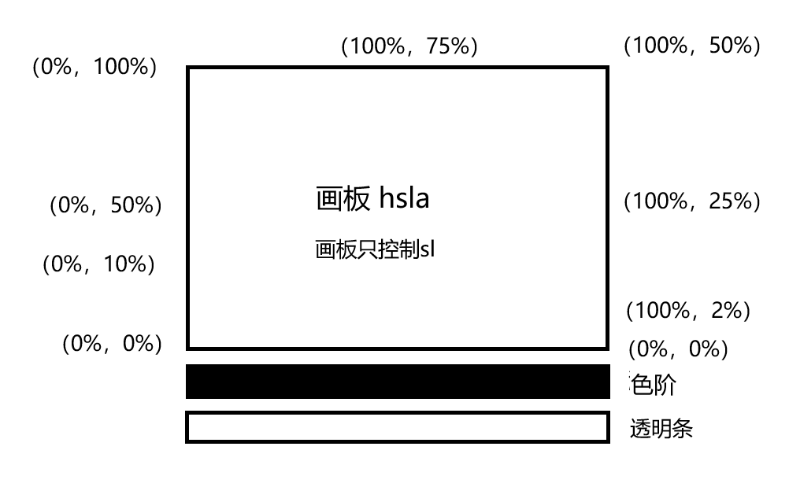
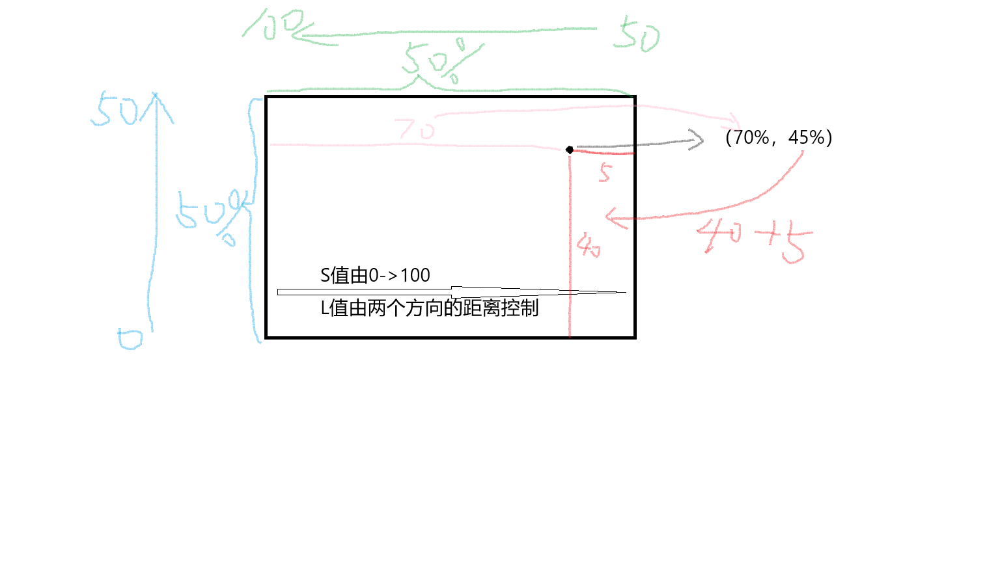
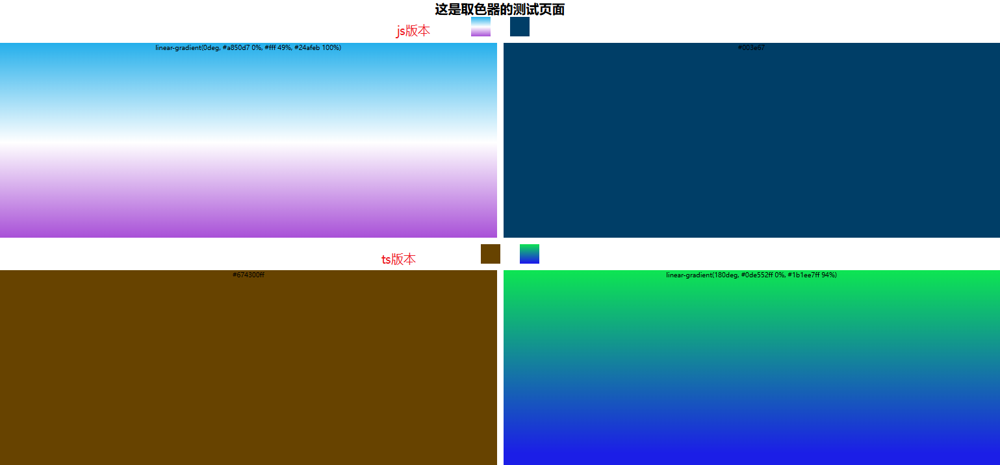

# 取色器
自定义取色器的布局，实现取色器


项目文件说明：

- xl-color-picker.js   index.html   js原生实现的例子
- colorPicker文件夹中的是vue版本的取色器


## 实现过程&步骤
### 1.自定义布局
使用html和css实现


### 2.实现取色器
大致思路：基于hsla实现以下功能

hsla(hue, saturation, lightness, alpha)\
色调、饱和度、亮度、透明度\
hsla(0, 100%, 50%, 0.5)

- 颜色板的取值
- 透明度的取值
- 色阶柱的取值

具体实现思路：
- 监听鼠标事件，计算出颜色板、透明度条、色阶柱的百分比值，获取到hsla值
- 将所获得的hsla值，转换成HEX值，并赋值给input标签的value属性


性能问题：\
可能会出现的问题有，卡顿、不连贯、鼠标监听事件不准确等

解决方案：\
暂定！！！


### 颜色之间的格式转换

#### HEX和RGB转换原理

##### **HEX简介**

  1. 十六进制颜色；
  2. 通过16进制0~F这16个字符来表达颜色，`#000`为黑色, `#FFF`为白色；
  3. HEX简写包括3位和4位（包含透明度，最后一位表示透明度，浏览器是如此，其他暂不确定），全写包括6位和8位（包含透明度，最后两位表示透明度）。


##### **RGB简介**

    1. 红绿蓝三个颜色通过不同亮度,外加alpha透明度，来组合成为需要的颜色；
    2. 0为最暗, 255为最亮，`rgb(0,0,0)`为黑色, `rgb(255,255,255)`为白色；
    3. 透明度表示：`rgba(255,0,0,0.5)`。


##### **转换原理**

RGB与HEX中每个颜色都是一一对应的关系：

  1. HEX = RGB的数值转为16进制数，如果只有一位，前面补零。
  2. HEX的透明度 = RGB的透明度 * 255，然后转为16进制数，如果只有一位，前面补零。
  3. RGB的数值 = 16 * HEX的第一位 + HEX的第二位。
  4. RGB的透明度 = (16 * HEX的透明度第一位 + HEX的透明度第二位) / 255。


```javascript
rgbToHex: function (e) {
    var r = Number(e.r).toString(16),
        t = Number(e.g).toString(16),
        n = Number(e.b).toString(16),
        o = Math.round(255 * e.o).toString(16)
    return (
        r.length < 2 && (r = 0 + r),
        t.length < 2 && (t = 0 + t),
        n.length < 2 && (n = 0 + n),
        o.length < 2 && (o = 0 + o),
        r[0] == r[1] && t[0] == t[1] && n[0] == n[1] && (o[0], o[1]),
        {
            r: r,
            g: t,
            b: n,
            o: o,
            complete: '#' + (r + t + n + (1 == e.o ? '' : o)),
        }
    )
}
hexToRgb: function (e, r) {
    var t,
        n,
        o,
        s,
        a = (e = e.replace('#', '')).split('')
    return (
        3 == e.length
        ? ((t = parseInt(a[0] + a[0], 16)),
           (n = parseInt(a[1] + a[1], 16)),
           (o = parseInt(a[2] + a[2], 16)),
           (s = 1))
        : 4 == e.length
        ? ((t = parseInt(a[0] + a[0], 16)),
           (n = parseInt(a[1] + a[1], 16)),
           (o = parseInt(a[2] + a[2], 16)),
           (s = Math.round((parseInt(a[3] + a[3], 16) / 255) * 100) / 100))
        : 6 == e.length
        ? ((t = parseInt(a[0] + a[1], 16)),
           (n = parseInt(a[2] + a[3], 16)),
           (o = parseInt(a[4] + a[5], 16)),
           (s = 1))
        : 8 == e.length &&
        ((t = parseInt(a[0] + a[1], 16)),
         (n = parseInt(a[2] + a[3], 16)),
         (o = parseInt(a[4] + a[5], 16)),
         (s = Math.round((parseInt(a[6] + a[7], 16) / 255) * 100) / 100)),
        {
            r: t,
            g: n,
            b: o,
            o: s,
            complete: r
            ? 'rgba(' + [t, n, o, s].join(',') + ')'
            : 'rgb(' + [t, n, o].join(',') + ')',
        }
    )
},
```


#### HSL和RGB转换原理

##### HSL简介 #####

色调饱和度亮度模式：

  1. Hue(色调)。0(或360)表示红色，120表示绿色，240表示蓝色，也可取其他数值来指定颜色。取值为：0 - 360；
  2. Saturation(饱和度)。取值为：0.0% - 100.0% ；
  3. Lightness(亮度)。取值为：0.0% - 100.0% 。
  4. 不包含透明度：`hsl(210,100%,50%)`，包含透明度：`hsla(210,100%,50%,0.5)`

##### RGB简介 #####

  1. 红绿蓝三个颜色通过不同亮度,外加alpha透明度，来组合成为需要的颜色；
  2. 0为最暗, 255为最亮，`rgb(0,0,0)`为黑色, `rgb(255,255,255)`为白色；
  3. 透明度表示：`rgba(255,0,0,0.5)`。

##### 转换原理 #####

- **`RGB`转`HSL`的算法描述**

 1. 把`RGB`值转成【0，1】中数值。

 2. 找出R,G和B中的最大值。

 3. 计算亮度：`L=(maxcolor + mincolor)/2`

 4. 如果最大和最小的颜色值相同，即表示灰色，那么S定义为0，而H未定义并在程序中通常写成0。

 5. 否则，根据亮度L计算饱和度S：

    ```JavaScript
    if(L<0.5){
        S=(maxcolor-mincolor)/(maxcolor + mincolor);
    }
    if(L>=0.5){
        S=(maxcolor-mincolor)/(2.0-maxcolor-mincolor);
    }
    ```

 6. 计算色调H：

    ```JavaScript
    if(R=maxcolor){
        H=(G-B)/(maxcolor-mincolor);
    }else if(G=maxcolor){
        H=2.0+(B-R)/(maxcolor-mincolor);
    }else if(B=maxcolor){
        H=4.0+(R-G)/(maxcolor-mincolor);
    }
    ```

    `H *= 60`，如果H为负值，则加360。

说明：

  1. 由步骤3的式子可以看出亮度仅与图像的最多颜色成分和最少的颜色成分的总量有关。亮度越小，图像越趋于黑色。亮度越高图像越趋于明亮的白色。
  2. 由步骤5的式子可以看出饱和度与图像的最多颜色成分和最少的颜色成分的差量有关。饱和度越小，图像越趋于灰度图像。饱和度越大，图像越鲜艳，给人的感觉是彩色的，而不是黑白灰的图像。
  3. 色调觉得了人对图像的不同的颜色感受。
  4. 从第6步的计算看，H分成0～6区域。RGB颜,色空间是一个立方体而HSL颜色空间是两个六角形锥体，其中的L是RGB立方体的主对角线。因此，RGB立方体的顶点：红、黄、绿、青、蓝和品红就成为HSL六角形的顶点，而数值0～6就告诉我们H在哪个部分。

- **`HSL`转`RGB`的算法描述**

 1. `if(S==0)`,表示灰色，定义R,G和B都为L.

 2. 否则，测试L:

    ```JavaScript
    if(L<0.5){
        temp2=L*(1.0+S);
    }
    if(L>=0.5){
        temp2=L+S-L*S;
    }
    ```

 3. `temp1=2.0*L-temp2`

 4. 把H转换到0～1, `H /= 360`

 5. 对于R,G,B，计算另外的临时值temp3。方法如下：

    ```JavaScript
    for R, temp3=H+1.0/3.0
    for G, temp3=H
    for B, temp3=H-1.0/3.0
    if(temp3<0){
        temp3=temp3+1.0;
    }
    if(temp3>1){
        temp3=temp3-1.0;
    }
    ```

 6. 对于R,G,B做如下测试：

    ```JavaScript
    If(6.0*temp3<1){
        color=temp1+(temp2-temp1)*6.0*temp3;
    }else if(2.0*temp3<1){
        color=temp2;
    }else if(3.0*temp3<2){
        color=temp1+(temp2-temp1)*((2.0/3.0)-temp3)*6.0;
    }else{
        color=temp1;
    }
    ```

更详细可查看：<https://en.wikipedia.org/wiki/HSL_and_HSV#From_HSL>

文中部分内容参考：<https://www.cnblogs.com/daiguagua/p/3311756.html>

### 循环队列

使用队列来存储历史颜色

```javascript
//  循环队列存储历史颜色
class ColorCircularQueue {
    /**
     * 构造函数，初始化
     * @param {*} k 队列容量
     */
    constructor(k) {
        // 容量
        this.capacity = k
        // 存储数据的数组
        this.elements = new Array(k)
        // 队尾指针
        this.rear = -1
        // 队首指针
        this.front = 0
        // 记录队列中元素的数量
        this.count = 0
    }

    /**
     * 插入元素
     * @param {*} value 插入值
     */
    enQueue(value) {
        if (this.count === this.capacity) {
            // 队列已满，移除第一个元素
            this.front = (this.front + 1) % this.capacity
        } else {
            // 增加计数
            this.count++
        }
        // 插入新元素到数组末尾
        this.rear = (this.rear + 1) % this.capacity
        this.elements[this.rear] = value
    }

    // 移除队首元素
    deQueue() {
        if (this.isEmpty()) {
            return false
        }
        // 将 front 移动到下一个元素
        this.front = (this.front + 1) % this.capacity
        // 减少计数
        this.count--
        return true
    }

    // 获取队首元素
    Front() {
        if (this.isEmpty()) {
            return -1
        }
        return this.elements[this.front]
    }

    // 获取队尾元素
    Rear() {
        if (this.isEmpty()) {
            return -1
        }
        return this.elements[this.rear]
    }

    /**
     * 判断队列是否为空
     * @returns 布尔值
     */
    isEmpty() {
        return this.count === 0
    }

    /**
     * 判断队列是否已满
     * @returns 布尔值
     */
    isFull() {
        return this.count === this.capacity
    }

    /**
     * 清除队列
     */
    clear() {
        this.elements = new Array(this.capacity)
        this.front = 0
        this.rear = -1
        this.count = 0
    }

    /**
     * 打印队列
     * @returns 直接输出
     */
    print() {
        console.log('队列中元素：')
        if (this.isEmpty()) {
            console.log('队列为空')
            return
        }
        let str = ''
        for (let i = 0; i < this.count; i++) {
            str += this.elements[(this.front + i) % this.capacity] + ' '
        }
        console.log(str)
    }

    /**
     * 获取队列
     * @returns 数组格式（当前队列中的所有元素）
     */
    getQueue() {
        let temArray = new Array(this.capacity)
        if (this.isEmpty()) {
            console.log('队列为空')
            return
        }
        for (let i = 0; i < this.count; i++) {
            temArray[i] = this.elements[(this.front + i) % this.capacity]
        }
        return temArray
    }
}
```


### 滑块的实现
```html
    <!-- 色阶滑块 -->
    <div class="xl-color-picker-bottom-right-saturation-slide"></div>
```

```css
.xl-color-picker-bottom-right-saturation-slide {
    width: 0.7rem;
    height: 0.7rem;
    border-radius: 50%;
    position: absolute;
    left: 50px;
    top: 7px;
    transform: translate(-5px, -5px);
    box-shadow: 0 0 0 3px #fff,
        inset 0 0 2px 2px rgb(0 0 0 / 0%),
        /*等价于rgba(0,0,0,0.4)*/
        0 0 2px 3px rgb(0 0 0 / 50%);
    /*等价于rgba(0,0,0,0.5)*/
    cursor: pointer;
}
```

```javascript
/**
 * 鼠标移动事件
 * @param {*} e 鼠标事件
 * @param {*} ele 移动元素条
 * @param {*} slide 滑块元素
 * @param {*} availableLabel 是否可用
 */
function mousemove(e, ele, slide, availableLabel) {
    if (!availableLabel) return;
    let width = ele.offsetWidth;  // 当前元素的宽度
    let height = ele.offsetHeight; // 当前元素的高度
    // 判断鼠标移动位置是否已经超出了box的范围，从而设置滑块的进度
    if (e.clientX <= ele.offsetLeft) {  // 最左
        updatedSlidePosition(slide, slide.offsetWidth / 2);
    } else if (e.clientX >= ele.offsetLeft + width) {  // 最右
        updatedSlidePosition(slide, width - slide.offsetWidth / 2);
    } else {  // 中间
        updatedSlidePosition(slide, e.clientX - ele.offsetLeft);
    }
}

/**
 * 鼠标按下事件
 * @param {*} ele 移动元素条
 * @param {*} slide 滑块元素
 * @param {*} availableLabel 是否可用
 */
function mousedown(ele, slide, availableLabel) {
    ele.addEventListener('mousedown', function (e) {
        availableLabel = true;
        // 透明度条的长度px
        let alphaBarWidth = ele.offsetWidth;
        // 当前点击位置的相对于条的宽度
        let leftWidth = e.clientX - ele.offsetLeft;

        // 滑块位置更新
        updatedSlidePosition(slide, leftWidth)

        // 绑定mousemove和mouseup事件到document上
        document.addEventListener('mousemove', function (e) {
            mousemove(e, ele, slide, availableLabel);
        }, false);
        document.addEventListener('mouseup', function (e) {
            availableLabel = false;
            // 解绑mousemove事件
            document.removeEventListener('mousemove', mousemove, false);
        }, false);
    });
}

// 透明度条的鼠标事件标签
let colorPickerBottomAlphaLabel = false;

// 透明度条的鼠标按下事件
mousedown(colorPickerBottomAlpha, colorPickerBottomAlphaSlide, colorPickerBottomAlphaLabel);
```

### html 页面不能选中状态
```css
user-select: none;
```

### 色板的实现





#### 介绍：

**画板只控制SL，H通过色阶来控制，A通过透明条来控制**


**画板中值的变化说明：**

- **最左**

**S不变，L从下到上0->100**


- **最下：**

**当一直在最小方左右移动的时候，其值一直是（0%，0%）**


- **最右：**

**当一直在最右边移动的时候，其S值一直是100，L从下到上0->50。特殊的：当移动到最下方的时候，其S值为0**


- **最上：**

**当一直在最上方移动的时候，其S值一直是100，L值从右到左50->100。特殊：当移动到最左边的时候，其S的值为0**


- **中间：**

**S值从左到右0->100， L值由两个方向的距离控制（下到上和右到左各占50，按照比例得到L的值）**


### 吸管拾色器

原理：

1. 用户交互：

用户通过点击或激活吸管工具开始取色过程。
用户将吸管工具移动到想要获取颜色的位置。

2. 屏幕坐标获取：

吸管工具需要知道用户点击或选择的屏幕位置的坐标。

3. 颜色数据获取：

根据用户选择的屏幕坐标，吸管工具需要获取该位置的颜色数据。这通常涉及到以下几个技术：

a. Canvas API：

如果吸管工具在一个Canvas元素上操作，可以使用CanvasRenderingContext2D.getImageData()方法来获取像素数据。
这个方法返回一个ImageData对象，其中包含了一个像素数组，每个像素由四个部分组成：红、绿、蓝和透明度（RGBA）。

b. EyeDropper API：

这是一个浏览器提供的API，允许网页直接访问用户屏幕的颜色数据。
使用EyeDropper.open()方法，用户可以选择屏幕上的任何颜色，然后API会返回一个包含颜色信息的对象。

4. 颜色表示：

获得的颜色数据通常以RGB或RGBA格式表示，但也可以转换为其他颜色空间，如HEX或HSL。
例如，一个颜色可能以rgba(255, 255, 255, 1)的形式表示，这代表不透明的白色。

5. 用户反馈：

一旦获取了颜色数据，吸管工具通常会以某种方式向用户显示所选颜色，例如在颜色预览框中显示颜色，或者更新颜色值输入字段。

6. 颜色应用：

用户选择颜色后，可以将其应用于其他元素或操作，如填充一个图形、设置文本颜色等。

7. 性能和优化：

在实现吸管工具时，需要考虑性能问题，尤其是在处理大型图像或复杂页面时。
为了提高性能，可能需要对Canvas操作进行优化，或者限制颜色取样的频率。

实现方法：
1. 不使用工具
```javascript
    // 获取当前屏幕

    // 使用canvas获取屏幕鼠标下的每个像素

    // 返回颜色值
```

2. 使用EyeDropper API
```javascript
colorPickerBottomAbsorb.addEventListener("click", () => {
    console.log("点击了吸管");

    if (!window.EyeDropper) {
        resultElement.textContent = "你的浏览器不支持 EyeDropper API";
        return;
    }

    const eyeDropper = new EyeDropper();

    eyeDropper
        .open()
        .then((result) => {
            console.log("取色", result.sRGBHex);

        })
        .catch((e) => {
            console.log("取色失败", e);
        });
});

```

### 线性渐变
实现思路：\
使用数组存储颜色值，通过循环遍历数组，计算出颜色值，并设置到颜色板中

```javascript
// 数组格式

[
    {
        // 当前滑块
        'slider': newGradientSlider,
        // 滑块的默认颜色
        'color': color,
        // 距离渐变条的左侧距离
        'positionX': position,
        // 百分比
        'percentages': 0,
    },
    {
         // 当前滑块
        'slider': newGradientSlider,
        // 滑块的默认颜色
        'color': color,
        // 距离渐变条的左侧距离
        'positionX': position,
        // 百分比
        'percentages': 0,
    }
]

```


```css
/* 渐变轴为 45 度，从蓝色渐变到红色 */
linear-gradient(45deg, blue, red);

/* 从右下到左上、从蓝色渐变到红色 */
linear-gradient(to left top, blue, red);

/* 色标：从下到上，从蓝色开始渐变，到高度 40% 位置是绿色渐变开始，最后以红色结束 */
linear-gradient(0deg, blue, green 40%, red);

/* 颜色提示：从左到右的渐变，由红色开始，沿着渐变长度到 10% 的位置，然后在剩余的 90% 长度中变成蓝色 */
linear-gradient(.25turn, red, 10%, blue);

/* 多位置色标：45% 倾斜的渐变，左下半部分为红色，右下半部分为蓝色，中间有一条硬线，在这里渐变由红色转变为蓝色 */
linear-gradient(45deg, red 0 50%, blue 50% 100%);

```
渐变的百分比：0% - 100%

计算滑块到渐变条最左端的百分比


### 高度问题
色板操作的时候的高有问题， 初始化的时候渐变条的滑块位置问题

解决办法：
```javascript
// 获取元素相对于视口的位置
const rect = ele.getBoundingClientRect();

// 获取元素相对于文档左边的位置
const leftPosition = rect.left + window.scrollX;
```
getBoundingClientRect() 返回的是一个 DOMRect 对象，其中 top 属性表示元素的顶部与视口顶部的垂直距离


### 拖拽移动
```html
<!DOCTYPE html>
<html lang="en">

<head>
    <meta charset="UTF-8">
    <meta name="viewport" content="width=device-width, initial-scale=1.0">
    <title>Draggable Element</title>
    <style>
        .xl-color-picker.canmove {
            cursor: move;
        }
    </style>
</head>

<body>
    <div class="xl-color-picker canmove"
        style="width: 100px; height: 100px; background-color: red; position: absolute; top: 50px; left: 50px;"></div>
    <script>
        document.addEventListener('DOMContentLoaded', function () {
            var colorPicker = document.querySelector('.xl-color-picker.canmove');
            var isDragging = false;
            var startX, startY;

            colorPicker.addEventListener('mousedown', function (e) {
                // cursor: pointer; 在设置了这个属性的元素上都不会出发那个移动事件
                if (getComputedStyle(e.target).cursor === 'move') {
                    // 记录鼠标按下时的位置
                    isDragging = true;
                    startX = e.clientX - colorPicker.getBoundingClientRect().left;
                    startY = e.clientY - colorPicker.getBoundingClientRect().top;
                }
            });

            document.addEventListener('mousemove', function (e) {
                if (isDragging) {
                    // 计算新的位置
                    var x = e.clientX - startX;
                    var y = e.clientY - startY;

                    // 获取屏幕的宽度和高度
                    var screenWidth = window.innerWidth;
                    var screenHeight = window.innerHeight;

                    // 获取元素的宽度和高度
                    var colorPickerWidth = colorPicker.offsetWidth;
                    var colorPickerHeight = colorPicker.offsetHeight;

                    // 限制元素不超出屏幕的右边和底边
                    var maxX = screenWidth - colorPickerWidth;
                    var maxY = screenHeight - colorPickerHeight;

                    // 设置元素的新位置，并确保它不超出屏幕
                    colorPicker.style.left = Math.min(Math.max(0, x), maxX) + 'px';
                    colorPicker.style.top = Math.min(Math.max(0, y), maxY) + 'px';
                }
            });

            document.addEventListener('mouseup', function () {
                isDragging = false;
            });
        });
    </script>
</body>

</html>

```

### 将css和html写入js
- css

```javascript
document.addEventListener('DOMContentLoaded', function () {
    // 创建style元素
    var style = document.createElement('style');
    style.type = 'text/css';

    // 你的CSS代码作为字符串
    var css = `
        /* CSS代码 */
        .color-picker {
            /* CSS规则 */
        }
        /* 其他规则 */
    `;

    // 设置style元素的内容
    style.appendChild(document.createTextNode(css));

    // 将style元素添加到head中
    document.head.appendChild(style);
});
```

- html
```javascript
    // 创建div元素并添加到body中
    var div = document.createElement('div');

    var html = `
    <div class="color-picker">Color Picker</div>
    // ......其他
    `

    div.innerHTML = html;
    document.body.appendChild(div);
```

### 绑定事件
使用 preventDefault() 和 stopPropagation() 时要小心，因为它们会改变事件的默认行为和传播方式，可能会导致意想不到的副作用。

在使用 stopPropagation() 时，事件将不会传播到其他监听器，即使它们绑定在同一个元素上。

在使用 preventDefault() 时，要确保这种行为是你想要的，因为有些元素的功能依赖于默认行为。

### 图片转化成base64,并在img标签中使用

```html

```

### 创建多个取色器
问题：当创建多个取色器时，如果一个取色器被操作，其他取色器也会被改变，如何解决？

解决办法：
1. 在每个取色器上添加一个唯一的 ID，然后在每个取色器上绑定一个唯一的事件处理程序。
2. 使用应该方法来获取元素的随机id （需要去掉了容易混淆的字符oOLl,9gq,Vv,Uu,I1。。。不然会出现无效id）
```javascript
    // 获取DOM的随机ID
    getRandomId(len = 8) {
        var chars = "ABCDEFGHJKMNPQRSTWXYZabcdefhijkmnprstwxyz";
        // 默认去掉了容易混淆的字符oOLl,9gq,Vv,Uu,I1
        var maxPos = chars.length;
        var pwd = "";
        for (let i = 0; i < len; i++) {
            pwd += chars.charAt(Math.floor(Math.random() * maxPos));
        }
        return pwd;
    },
```
3. 根据取色器父级元素绑定的随机id，来获取到操作的所有dom节点

```javascript
        let elementId = this.getRandomId();
        temColorPicker.id = elementId;
        
        // 获取到操作的dom
        let dom = {
            controllerShow: document.querySelector(`#${temColorPicker.id}`),  // 父级div
            close: document.querySelector(`#${temColorPicker.id} .xl-color-picker-close`),  // 关闭
            colorPicker: document.querySelector(`#${temColorPicker.id} .xl-color-picker`),  // 颜色选择器
            // 原色还是线性渐变选择模块
            showOriginal: document.querySelector(`#${temColorPicker.id} #show-original`), // 原始颜色的dom
            showLinear: document.querySelector(`#${temColorPicker.id} #show-linear`), // 渐变色的dom
            // ......
        };
```

# 问题描述
## 打开html报错（Failed to load resource: the server responded with a status of 404 (Not Found)）
问题描述：\
因为浏览器默认只支持本地文件，所以需要设置允许跨域访问，才能访问到本地文件。

解决办法：\
1. 使用 `--allow-file-access-from-files` 参数。
2. 将html和js文件脱出到一个目录，然后通过vscode的Live Server打开就可以了 


## 2025.1.4ts版本封装bug说明

- 《bug1》当通过色板选择颜色的时候，滑块移动到最左、最下的时候，在移动到其他地方，其颜色变成了红色为底色，但是色板的颜色还是原来的颜色，取到的颜色却是红色
- 《bug2》当滑动透明条的时候，颜色值的透明度值不发生变化


bug1解决办法：

添加一个变量来记录当前色板的H值，在updateCurrentColor方法中使用`h = this.hue`来设置


bug2解决办法：

修改了颜色格式化方法


# 效果展示

## 实现效果


## 取色器效果





# 版本功能说明

#### 版本v1.0

实现取色器的基本功能：js+html+css 原生实现

- 原色的选取
- 渐变色的选取
- 渐变添加和减少渐变颜色
- 渐变方向选择功能
- 吸管取色
- 透明度和色相的控制
- 颜色值输出，输入功能（右击底部的input框可以快速复制）
- 历史颜色的展示


#### 版本v2.0

新增vue版本的取色器功能

- 在vue组件中直接将文件夹colorPicker复制到vue项目中，index.vue中展示简单的示例
- 实现js+vue选项式的组件封装
- 实现ts+vue组合式的组件封装
- 如果是纯色会根据绑定的颜色值改变初始化的取色器的画板背景色，渐变条的颜色是默认的
- 如果是渐变色会根据绑定的值展示出对应的渐变色控制条，画板的背景色是默认的


#### 版本v3.0

- 新增格式化输出，属性format
- 优化ts封装的组件
- 解决bug===当通过色板选择颜色的时候，滑块移动到最左、最下的时候，在移动到其他地方，其颜色变成了红色为底色，但是色板的颜色还是原来的颜色，取到的颜色却是红色


# 注释

参考博客及其他教程地址：
- CSS HSL 颜色: https://www.w3ccoo.com/html/html_colors_hsl.asp#:~:text=HSL%20%E9%A2%9C%E8%89%B2%E5%80%BC.%20%E5%9C%A8
- 色彩空间中的HSL、HSV、HSB区别: https://www.zhihu.com/question/22077462#:~:text=HSB%20%E5%92%8C%20HSL
- 视频案例：https://www.bilibili.com/video/BV1KP4y187wQ/?spm_id_from=333.1007.top_right_bar_window_history.content.click
- 博客：https://segmentfault.com/a/1190000040789940#item-3
- 循环队列：https://zhuanlan.zhihu.com/p/266955673
- 线性渐变：https://developer.mozilla.org/zh-CN/docs/Web/CSS/gradient/linear-gradient
- 颜色格式转换：https://github.com/fxss5201/colorFormat